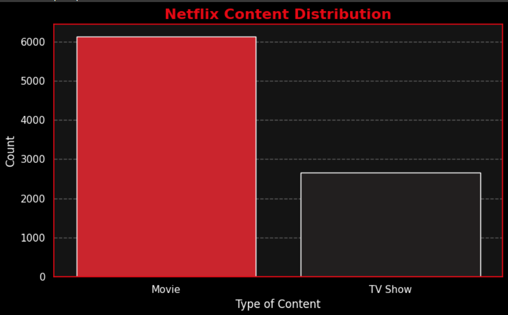
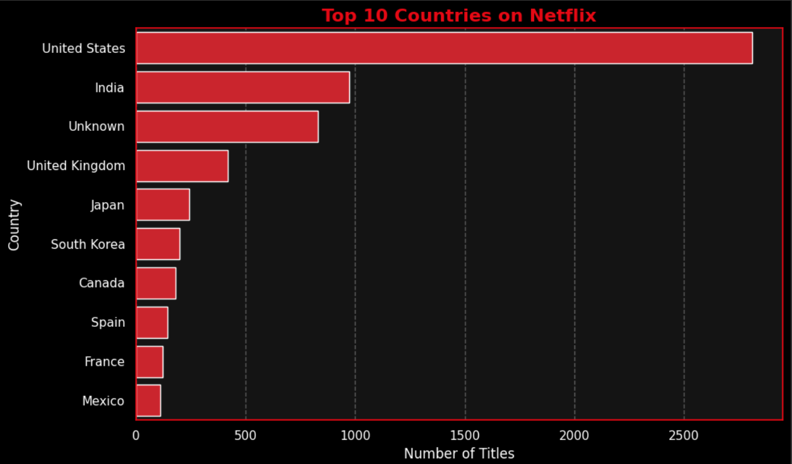
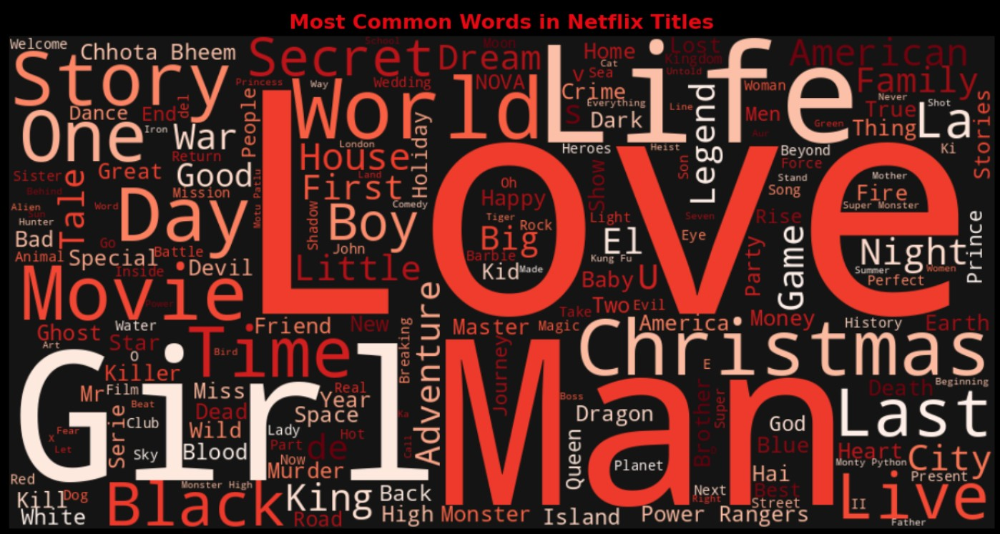
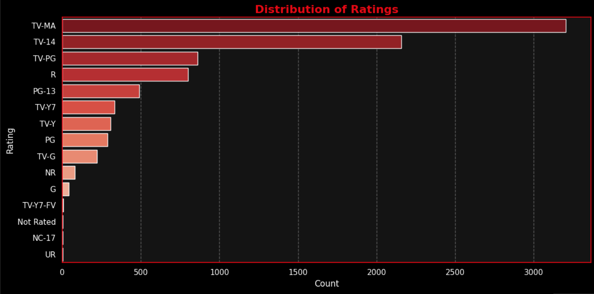
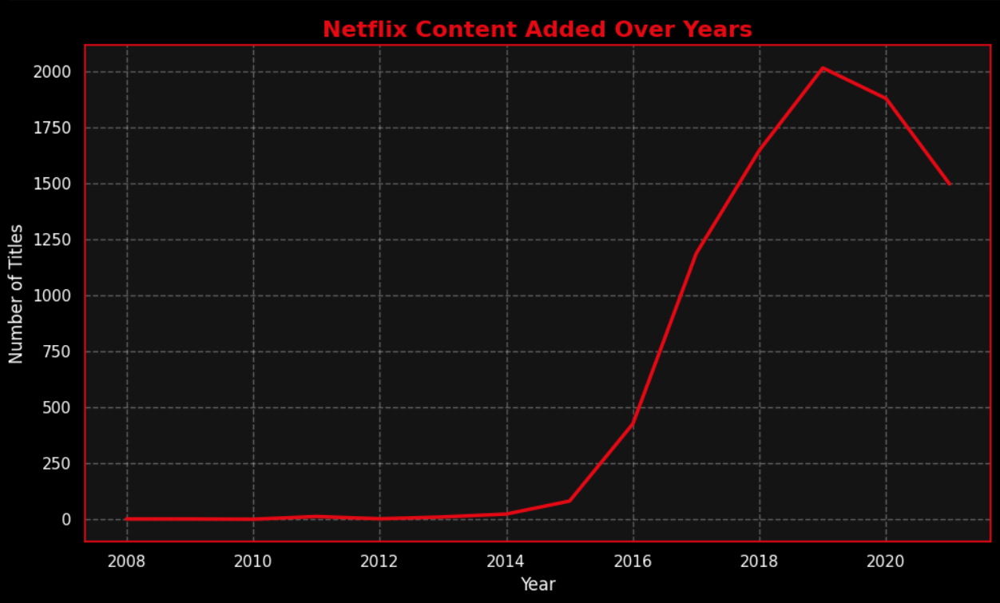

# 📊 Netflix Titles – Exploratory Data Analysis

This project performs a detailed exploratory data analysis (EDA) on the Netflix dataset, which includes information about over 7,000 movies and TV shows available on the platform.

The goal is to uncover trends, clean the data, and visualize insights that reveal how Netflix has evolved its content strategy over the years.

---

## 📁 Dataset Source
The dataset used is [Netflix Titles on Kaggle](https://www.kaggle.com/shivamb/netflix-shows).

---

## 🚀 What I Did

- Cleaned and preprocessed the dataset using **pandas**
- Handled missing values and extracted date-based features
- Created visualizations using **seaborn** and **matplotlib**
- Generated a **WordCloud** of frequently occurring words in titles
- Identified patterns across **release years, ratings, content types, and countries**

---

## 📈 Visual Highlights

- 📊 Distribution of Movies vs TV Shows  
- 🌍 Top Countries with Most Netflix Content  
- ⏳ Trend of Content Added Over the Years  
- 🎬 Most Common Ratings  
- ☁️ WordCloud of Title Keywords  

---

## 📎 Quick Links

- ▶️ **[View Notebook on Google Colab](https://colab.research.google.com/drive/1941DramiiU45UUguh5j1ZxPrBSsDRLrg?usp=sharing)**
- 🛠 **[View Code on GitHub](https://github.com/Vi-haa/Netflix-EDA-Analysis)**

---

- ## 📸 Visualizations

### 📊 Content Type Distribution

### 🌍 Top 10 Countries

### ☁️ WordCloud

### ⭐ Rating Distribution

### 📈 Year-wise Trends

---

## 📌 Tools Used

- Python 🐍
- pandas
- matplotlib
- seaborn
- WordCloud
- Google Colab
- Git & GitHub

---

## 📬 Contact

If you liked this project or want to connect:

- 📧 vihahibare04@gmail.com 
- 🔗 [LinkedIn Profile](https://www.linkedin.com/in/viha-hibare-b081992b6/)
